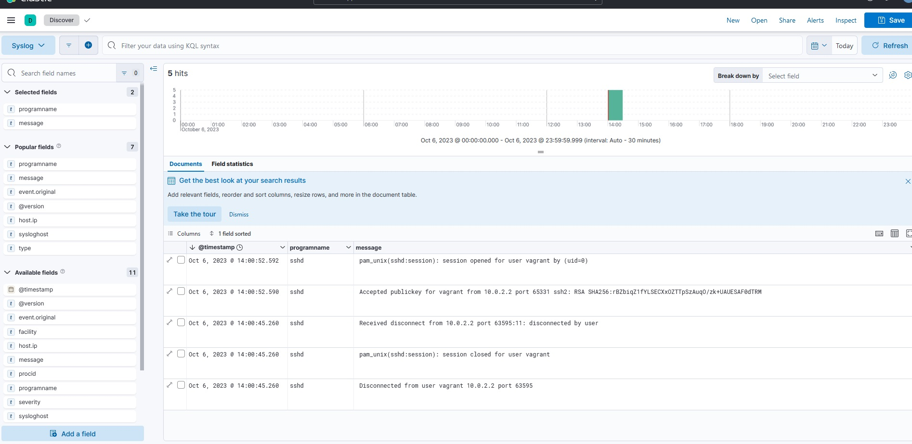

### Настройка rsyslog
На целевом хосте  
- создаётся шаблон json для форматирования логов перед отправкой;
- задаются правило отправки логов в Logstash;

### Настройка Logstash
- задаются правила input, output
- устанавливается filter для фильтрации логов демона sshd;
 

